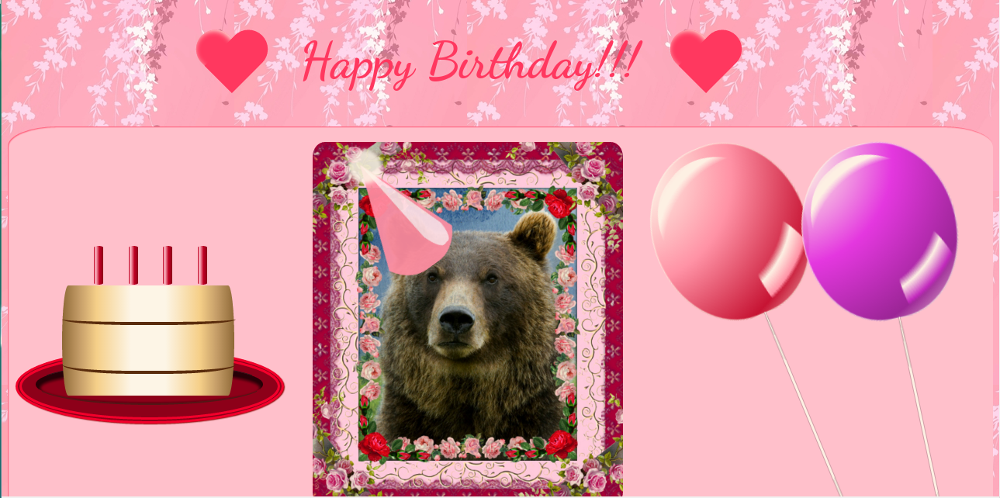

<a href="http://adrianaalter.github.io/Card/">This</a> is a birthday card featuring pure CSS3 animations (triggered by hovering over the cake, hearts, text, balloon, and central picture).  All of the items are drawn in CSS, using linear and radial gradients, layered opacities, and pseudo-content, and the framed bear picture was compiled via photo editing software.  The card also uses the HTML5 audio tag.

</img>
